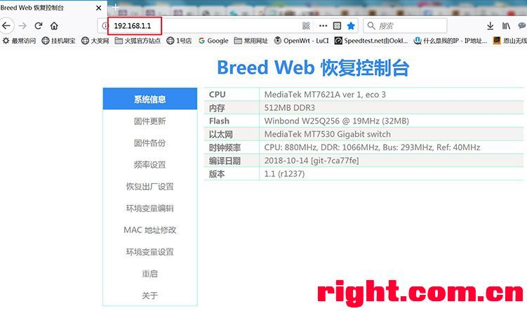
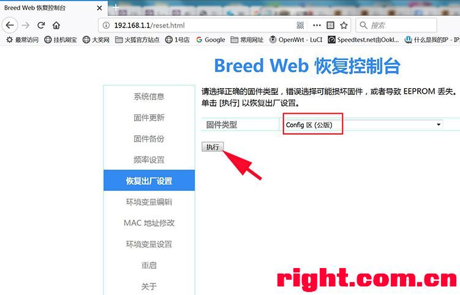
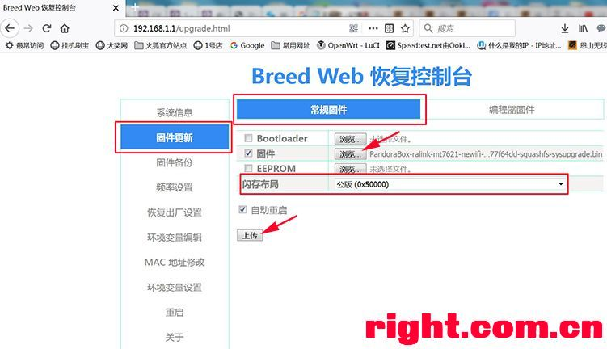
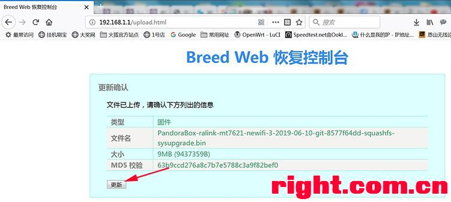
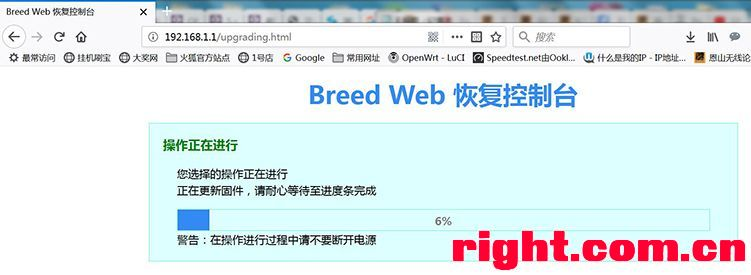
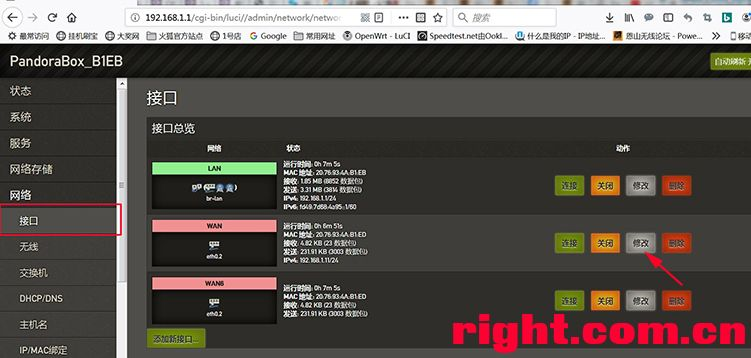
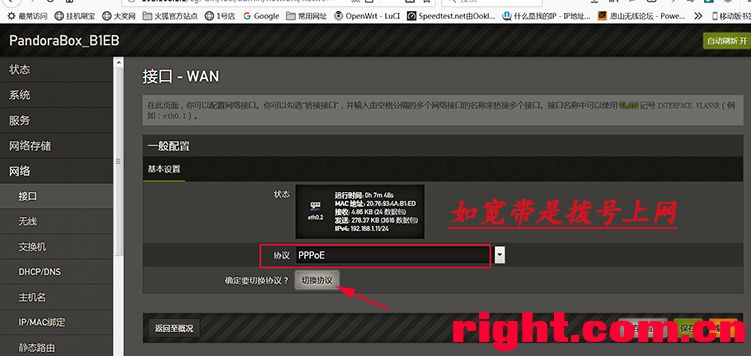
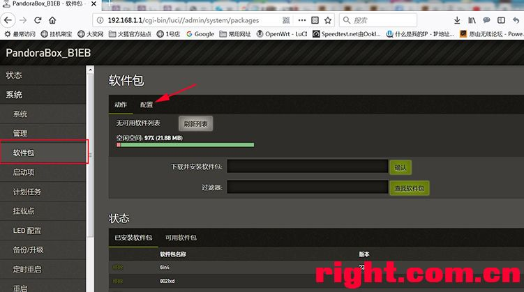
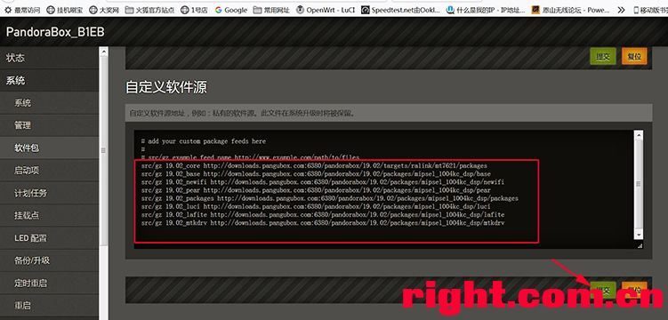

# Install PandoraBox on Newifi3-D2

Only for blocking ads on TV and personal learning

### Install Breed
  [Original Post](URL 'https://www.right.com.cn/forum/thread-342918-1-1.html')
  
- Start and Configure the router
- check if http://192.168.99.1/newifi/ifiwen_hss.html display 'success'
- ssh the router with user root
- upload newifi-d2-jail-break.ko to router:/tmp
- wait for the router to restart
- shutdown the power, press reset button then power on the router
  
### Install PandoraBox
  [Original Post](URL 'https://www.right.com.cn/forum/forum.php?mod=viewthread&tid=777441')
  
- enter the address of router's ip in browser

- reset breed

- upload the firmware

- update the firmware

- wait for router to restart

  
### Set Router
  [Original Post](URL 'https://www.right.com.cn/forum/forum.php?mod=viewthread&tid=777441')
  
- connect Internet

- set protocol. [Attention!] Ip of router should be different from ip of modem。

- add custom source. [Version of fireware is 19.06, but it works only when version of custom source is 19.02 on my own router.]


```
src/gz 19.02_core http://downloads.pangubox.com:6380/pandorabox/19.02/targets/ralink/mt7621/packages
src/gz 19.02_base http://downloads.pangubox.com:6380/pandorabox/19.02/packages/mipsel_1004kc_dsp/base
src/gz 19.02_newifi http://downloads.pangubox.com:6380/pandorabox/19.02/packages/mipsel_1004kc_dsp/newifi
src/gz 19.02_pear http://downloads.pangubox.com:6380/pandorabox/19.02/packages/mipsel_1004kc_dsp/pear
src/gz 19.02_packages http://downloads.pangubox.com:6380/pandorabox/19.02/packages/mipsel_1004kc_dsp/packages
src/gz 19.02_luci http://downloads.pangubox.com:6380/pandorabox/19.02/packages/mipsel_1004kc_dsp/luci
src/gz 19.02_lafite http://downloads.pangubox.com:6380/pandorabox/19.02/packages/mipsel_1004kc_dsp/lafite
src/gz 19.02_mtkdrv http://downloads.pangubox.com:6380/pandorabox/19.02/packages/mipsel_1004kc_dsp/mtkdrv
```
  
### Install SoftWare
- luci-i18n-xxxx-pro-zh-cn, available disk becomes 11.21MB form 21.88MB
- luci-i18n-xxx-pro-zh-cn
- adbyby